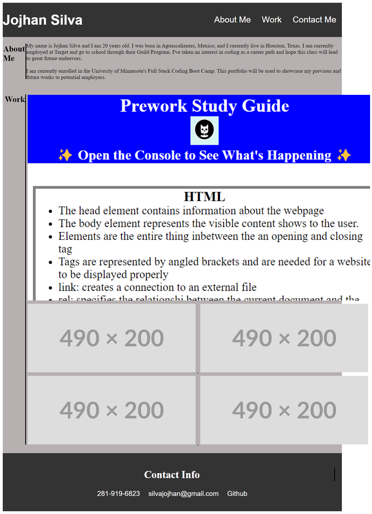

# Portfolio

## Description

In order to house my previous projects into one location, I have made this portfolio. This will allow future potential employers of my skills and
expertise regarding coding using HTML, CSS, and Javascript. This portfolio will let people view my past work, facts about myself, and has ways to contact me incase they want to reach out to me. 

NOTE! Since I have only previous project available, all pictures link to the study guide for now. The links are placeholders put in place until I can link other projects.

## Installation

Link to Github Pages link of live site
https://jojhans.github.io/secondchallenge/

## Usage

To add a screenshot, create an `assets/images` folder in your repository and upload your screenshot to it. Then, using the relative filepath, add it to your README using the following syntax:

   

## Credits

Reset stylesheet

http://meyerweb.com/eric/tools/css/reset/ 
   
   v2.0 | 20110126
   License: none (public domain)

Placeholder Images

https://placehold.co/
